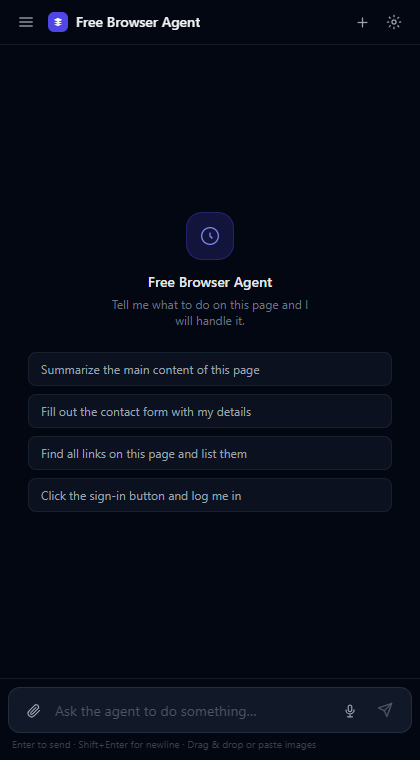
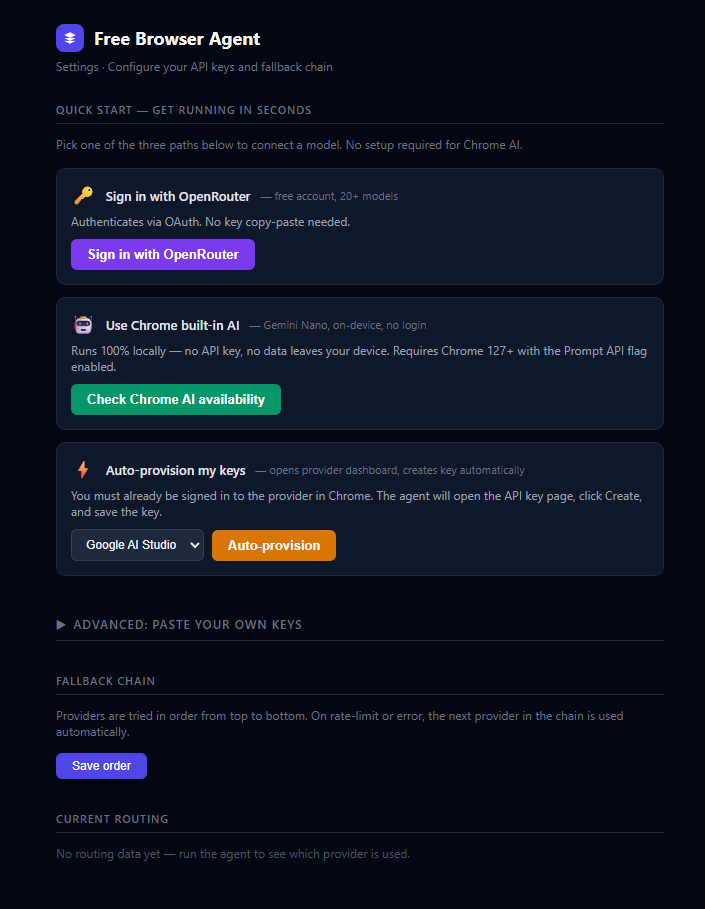

# Free Browser Agent

**Free-tier LLM aggregation for agentic browser control — no subscription, no server, your keys stay on your machine.**

Control any webpage with natural language. Click, fill forms, summarize, navigate — the agent routes your instruction across Google Gemini, Groq, Cerebras, Chrome built-in AI (Gemini Nano), OpenRouter, and Anthropic, automatically failing over on rate limits. Together the free tiers give you roughly a billion tokens per month at $0.

---

## Why this exists

Every AI browser agent worth using is closed-source or locked behind a paid subscription. Free Browser Agent is the open alternative:

- **No waitlist, no monthly fee, no proprietary cloud** — install the extension, paste a key, go
- **Your API keys never leave your browser** — encrypted with AES-256-GCM in `chrome.storage.session`, gone when you quit Chrome
- **Six providers, automatic failover** — the router picks the first healthy provider in your priority list; you configure the order
- **Full source, MIT licensed** — fork it, audit it, extend it

---

## Screenshots

<!-- TODO(main-thread E2E): replace with real Playwright captures -->




> Real screenshots will be added with the v0.1.0 release assets. See `docs/screenshots/` — the directory is tracked, the PNG files are pending the first live E2E run.

---

## Supported providers

| Provider | Free tier | Default model |
|---|---|---|
| **Chrome AI (Gemini Nano)** | Unlimited, on-device | `gemini-nano` |
| **Groq** | 14,400 req/day | `llama-3.3-70b-versatile` |
| **Google Gemini** | 1,500 req/day | `gemini-2.0-flash` |
| **Cerebras** | 30 req/min | `llama-3.3-70b` |
| **OpenRouter (free tier)** | varies | `:free` suffix models |
| **Anthropic** | $5 trial credit | `claude-haiku-4-5` |

Provider IDs (`google`, `groq`, `cerebras`, `openrouter`, `anthropic`, `chrome-ai`) are defined in `src/shared/types.ts`. The default priority order is: Chrome AI → Groq → Google → Cerebras → OpenRouter → Anthropic. You can reorder the chain on the Options page.

---

## Quick start

### 1. Clone and build

```bash
git clone https://github.com/aumslaw/free-browser-agent.git
cd free-browser-agent
pnpm install
pnpm build          # outputs dist/
```

`pnpm` is recommended; `npm install && npm run build` works too.

**Requirements:** Node 20+, Chrome 122+

### 2. Load in Chrome

1. Open `chrome://extensions`
2. Enable **Developer mode** (top-right toggle)
3. Click **Load unpacked**
4. Select the `dist/` folder

The Free Browser Agent icon appears in your toolbar.

### 3. Onboard — pick any of the three methods

See the [Onboarding](#onboarding) section below for details. The shortest path is **OpenRouter OAuth** (one click, no copy-paste). If you prefer zero external accounts, use **Chrome built-in AI** (Gemini Nano, fully on-device).

### 4. Use it

Click the toolbar icon to open the side panel. Type any instruction:

```
Summarize this page in 3 bullet points
Click the first search result
Fill in the login form with username "demo" and password "demo"
What is the price of the highlighted product?
```

The agent uses your page's DOM to carry out the instruction, escalates to Chrome DevTools Protocol for cross-origin frames or trusted-input fields, and streams the result back to the chat panel.

---

## Onboarding

Three zero-friction paths are available. After first-use, your keys are persisted in encrypted storage — you only onboard once.

### Method 1 — OpenRouter OAuth (recommended, one click)

OpenRouter's PKCE S256 OAuth flow is the fastest onboarding path: no manual key copy.

1. Open the side panel → click **Sign in with OpenRouter**
2. A browser popup opens to `openrouter.ai/auth`
3. Approve access → the popup closes and the extension stores your user-owned API key
4. Free-tier `:free` suffix models are immediately available

> **Human step required:** You must be signed in to OpenRouter in the popup browser window. The OAuth consent screen is a normal human-only browser flow; it cannot be automated.

### Method 2 — Chrome built-in AI (Gemini Nano, keyless)

Runs Gemini Nano entirely on-device via the Chrome Prompt API. No account, no API key, no network request to any LLM provider.

1. Open the side panel → click **Use Chrome built-in AI**
2. If Gemini Nano is not yet downloaded, Chrome prompts a one-time model download
3. Once available, the extension routes through an offscreen document (the Service Worker cannot host the Prompt API) — this is automatic and transparent

> **Requirements:** Chrome 122+ with the Prompt API available (`chrome://flags/#optimization-guide-on-device-model` may need to be set to "Enabled BypassPerfRequirement" on some builds). Model availability varies by Chrome channel.

### Method 3 — Auto-provision Google + Groq (one-click, requires existing login)

The agent automates creation of free API keys on Google AI Studio and Groq console.

1. Open the side panel → click **Auto-provision keys**
2. The extension opens each provider's API key dashboard in a tab, clicks **Create**, reads the generated key via the content script (with CDP fallback), and saves it
3. On success, both providers are immediately available

> **Human step required:** You must already be logged into Google (for Google AI Studio) and Groq in your Chrome profile. The sign-in screens are not automated. If a CAPTCHA or UI change blocks the flow, the extension fails gracefully (`{ok:false, error}`) and falls back to asking you to paste the key manually.
>
> **Not-yet-verified:** The auto-provision path has unit-test coverage but has not been live-tested end-to-end against real provider dashboards. Treat it as beta until a real E2E run is documented.

### Advanced — manual key paste

From any provider: open the extension Options page (gear icon → Settings), paste your key, save. Supported for all six providers.

---

## Get API keys (all free)

| Provider | Sign-up link |
|---|---|
| Google Gemini | https://aistudio.google.com/app/apikey |
| Groq | https://console.groq.com/keys |
| Cerebras | https://cloud.cerebras.ai |
| OpenRouter | https://openrouter.ai/keys |
| Anthropic | https://console.anthropic.com/settings/keys |

Each provider's free tier requires an account but no payment method (Anthropic gives $5 of trial credit on signup).

---

## Architecture

```
Chrome Extension (MV3)
├── Background Service Worker
│   ├── agent-loop.ts   — LLM ↔ tool-call cycle (max 20 iterations)
│   ├── cdp.ts          — Chrome DevTools Protocol fallback
│   └── index.ts        — message router (side panel / content / options / onboarding)
│
├── Content Script (all_frames: true)
│   ├── index.ts        — message listener and dispatch
│   └── dom-ops.ts      — click, type, fillForm, scroll, readPage, waitForSelector,
│                          getUrl, getSelection (+ readText, getElementCoords via SA-1)
│
├── Offscreen Document
│   └── offscreen.ts    — proxy for Chrome Prompt API (Gemini Nano) — required because
│                          the Service Worker cannot host the Prompt API
│
├── Providers  (src/providers/)
│   ├── base.ts         — abstract Provider (chatCompletion / streamChatCompletion)
│   ├── google.ts       — Gemini adapter
│   ├── groq.ts         — Groq adapter (OpenAI-compatible)
│   ├── cerebras.ts     — Cerebras adapter (OpenAI-compatible)
│   ├── openrouter.ts   — OpenRouter adapter
│   ├── anthropic.ts    — Anthropic Messages API adapter
│   └── chrome-ai.ts    — Chrome Prompt API adapter (Gemini Nano, keyless)
│
├── Router  (src/router.ts)
│   └── priority-ordered failover, per-key RPM/RPD/TPM/TPD rate-limit ledger,
│       exponential-backoff cooldown (30s initial, 5min max)
│
├── Onboarding  (src/onboarding/)
│   ├── openrouter-oauth.ts — PKCE S256 flow via chrome.identity.launchWebAuthFlow
│   └── auto-provision.ts   — automated key creation for Google + Groq
│
├── Storage  (src/storage/)
│   ├── keys.ts         — list / save / delete provider keys
│   ├── crypto.ts       — AES-256-GCM via WebCrypto Subtle API; master key in session storage
│   └── ratelimit.ts    — cooldown counters with exponential backoff
│
├── Side Panel  (src/sidepanel/, Preact)
│   └── chat UI, streaming text render, tool-call inline display, provider badge
│
└── Options Page  (src/options/, Preact)
    └── key management, fallback-chain reorder, per-provider connection test
```

### How the agent loop works

1. Your message → background SW via `{kind:"agent:run"}`
2. SW calls `router.chatCompletion(messages, tools)` — routes to the first healthy provider
3. If the LLM replies with `tool_calls[]`, each call is dispatched:
   - DOM operations → `chrome.tabs.sendMessage` → content script → `dom-ops.ts`
   - Screenshots, cross-origin clicks, trusted-input events → CDP (`chrome.debugger`)
4. Tool results are appended as `role:"tool"` messages and the loop continues
5. The loop stops when the LLM sends a plain text reply or after 20 iterations
6. Every iteration emits `{kind:"agent:status"}` to the side panel for live rendering

### CDP escalation

When a content-script DOM op returns `{ok:false, escalate:"cdp"}`, the agent loop retries via `chrome.debugger`:

```
DOM op fails with escalate:"cdp"
  → cdp.attach(tabId)
  → Input.dispatchMouseEvent / Page.captureScreenshot / etc.
  → cdp.detach(tabId)
```

### Privacy

- **No telemetry.** Nothing is sent anywhere except the LLM provider you configured.
- **Keys encrypted at rest.** Provider API keys are stored with AES-256-GCM. The master key lives only in `chrome.storage.session` — it is cleared when you quit Chrome.
- **Page content stays local.** Page text sent to the LLM goes directly from your browser to the provider over HTTPS using your own key.
- **No extension server.** There is no proxy, no backend, no analytics endpoint.

---

## Build & test commands

```bash
pnpm build        # production build → dist/
pnpm dev          # watch mode (vite --watch), auto-rebuilds on save
pnpm tsc          # type-check only (tsc --noEmit), no output
pnpm test         # unit tests via Vitest (276 tests, 19 test files)
pnpm test:e2e     # Playwright e2e — loads unpacked dist/ in real Chromium
```

`pnpm test:e2e` requires `pnpm build` first and a Chrome/Chromium binary on PATH.

---

## License

MIT — see [LICENSE](LICENSE).

---

## Contributing

See [CONTRIBUTING.md](CONTRIBUTING.md).
